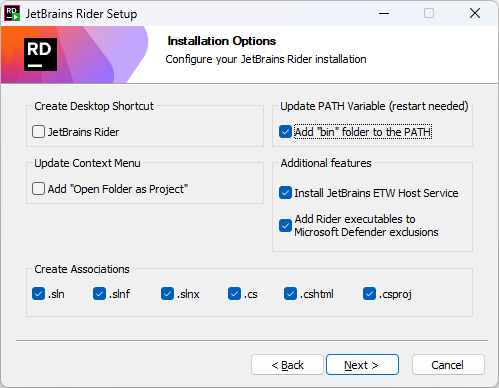
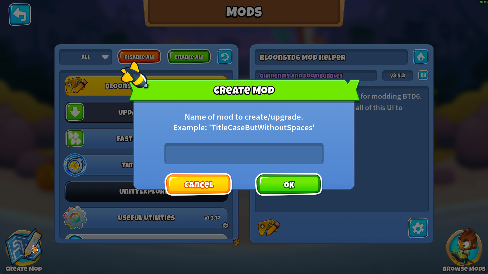
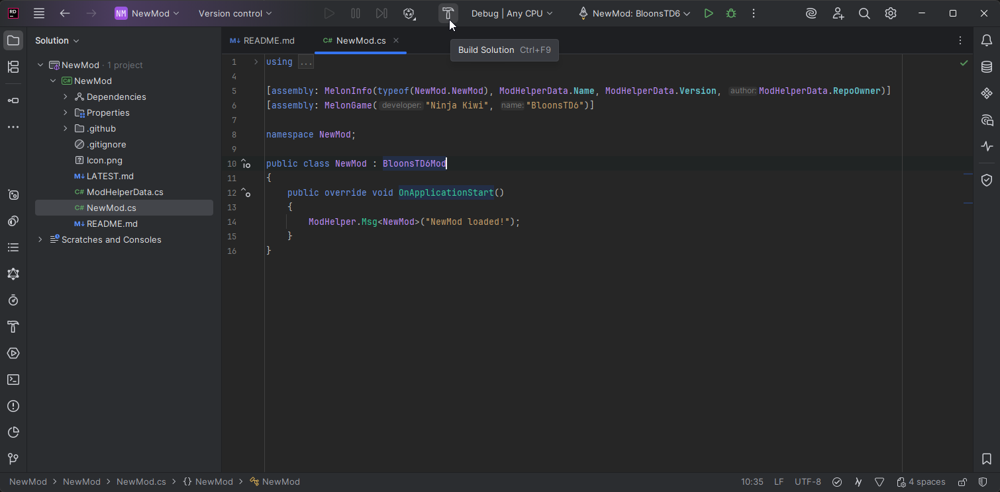
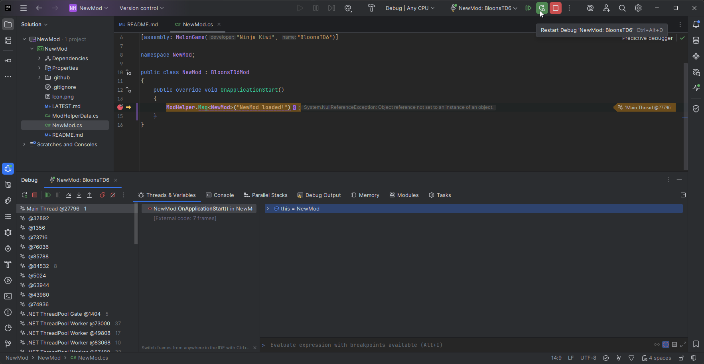

This page covers how to get started with creating Mods for BTD6.

**If you still need to install MelonLoader and Mod Helper for playing with mods, see
the [Install Guide](/wiki/Install-Guide).**

# Prerequisites

## Owning BTD6

We are only providing support for modifying legitimately purchased copies of the game.

## Basic Understanding of Coding / C#

This wiki is not a C# tutorial.
There are many places online you can go to in order to learn more.
BTD6 mods will usually be open source, so you can also try to learn more by looking at them.

## IDE (Integrated Development Environment)

The kind of modding that we're supporting is too advanced to just use a standard text editor like Notepad.
You're going to want to use an actual C# IDE, so you can choose from one of the 2 options below.
Feel free to use either, they will both work well, but Rider does have the Doombubbles Seal of Approval.

### [Rider   ](https://www.jetbrains.com/rider/download)

Rider used to cost money after 30 days, but now it's free!

User the installer for Rider as normal. When you get to the Installation Options step, it's recommended to check the
boxes for all the file association as well as for adding the "bin" to the PATH.

### [Visual Studio   ](https://visualstudio.microsoft.com/vs/community/)

Go through the Visual Studio installation process as normal, just being sure that you have selected the ".NET desktop
development tools" Workload.

# Getting Started

## Creating your Mod

Within BTD6, go into Mod Helper's Mods Menu and press the Create Mod button that's in the bottom left.

When prompted, enter the name of your mod. After creation, you'll be prompted to open the newly created mod using your
IDE (this depends on the .sln file being associated with your IDE). By default, it creates your mod folder within the "
BTD6 Mod Sources" folder in your Documents folder.

## Building your Mod

To build your mod to its DLL file, press the Build Solution button within your IDE. For Rider, that looks like:

If everything is set up correctly, this will build your mod and copy the DLL automatically to your BTD6 mods folder.
You'll need to do this each time after you make changes to your mods's code in order for the changes to apply in game.

## Debugging your Mod

One huge benefit of using an IDE is the ability to debug your code while it's running. Click the "Debug" button in the
top bar to start BTD6 with the debugger attached for your mod. You will then be able to create breakpoints in your code
to pause execution and view the running state of your code. For Rider, that looks like:

# Next Steps

You can become more skilled at modding BTD6 by increasing your knowledge in a few different areas.

### Knowledge of NK's GameModel system

**How It Helps**

Helps you modify towers and make custom effects well using their own system

**Ways to Learn**

- Looking through tower json dumps from the Export Game Data button in mod settings
- Looking at the source code for other mods' ModTower and ModUpgrade implementations

### Knowledge of NK's overall code structure

**How It Helps**

Informs the Harmony Patches needed to make more specific / custom mod changes

**Ways to Learn**

- Looking at decompiled code (simple: dnSpy, advanced: IDA/Il2cppdumper)
- Looking at the source code for other mods' Harmony Patches

### Knowledge of Mod Helper usage

**How It Helps**

Helps save time and make sure you're not reinventing the wheel

**Ways to Learn**

- Mod Helper wiki (you are here!)
- Looking at the source code for other mods' class structure