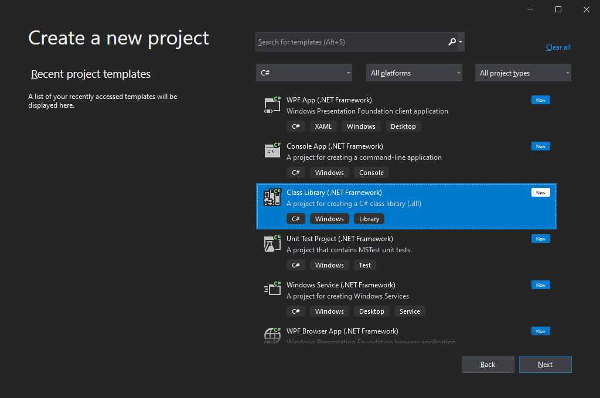
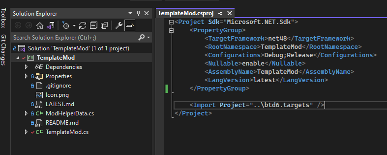
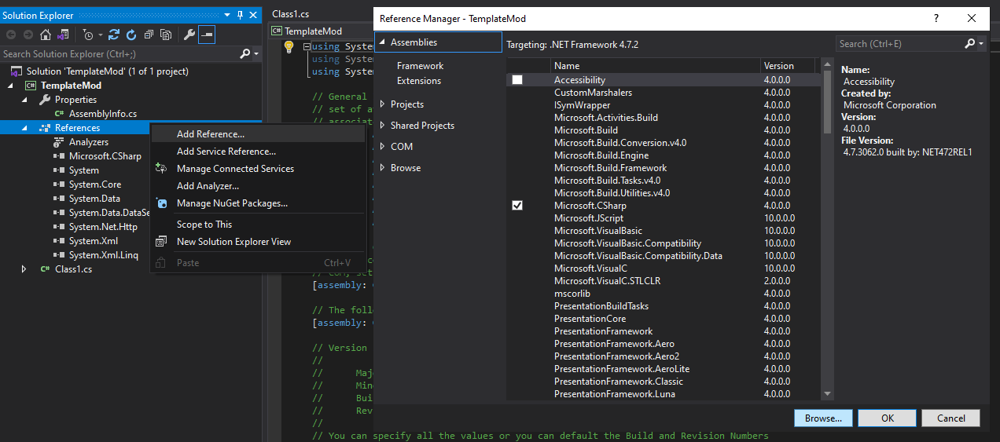
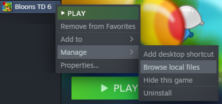
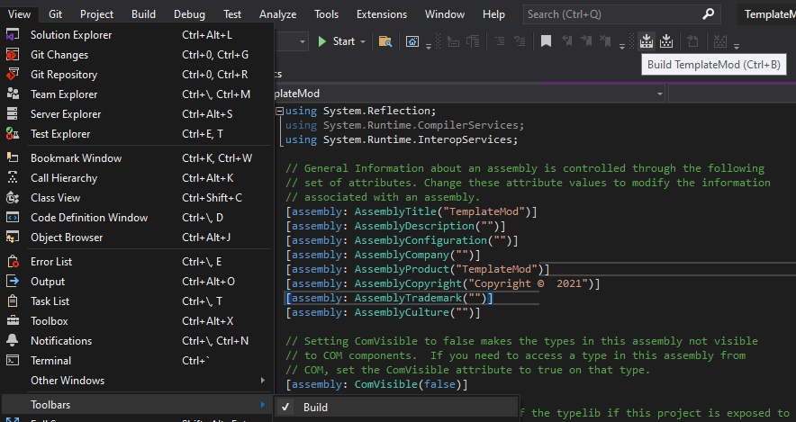
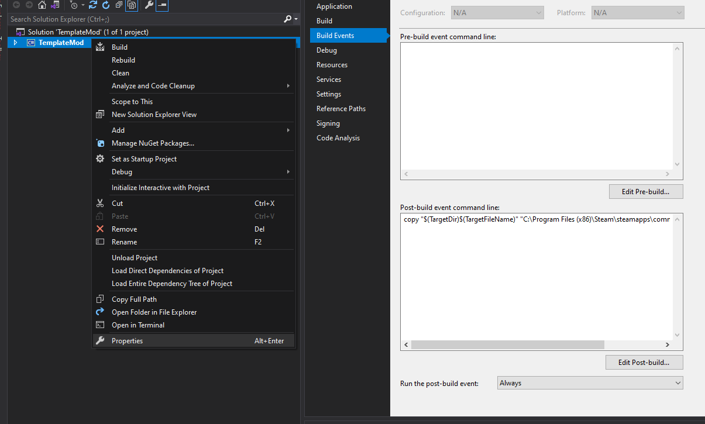

# See the updated [Getting Started page](/wiki/Getting-Started-Modding), Old Content below
---

# Creating a new Mod Project

You'll want to make a new project of the type "Class Library (.NET Framework)"

## IMPORTANT: For the folder to create your project in, you should choose the "BTD6 Mod Sources" directory which is generated by default in your Documents folder when running the game with Mod Helper installed. If it's the correct folder, it will have a `btd6.targets` file in it.



I'd recommend checking the "Place Solution and project in the same directory" box on the next page, but that's up to you.

# Dependencies

The new, easy way of doing dependencies is to utilize the `btd6.targets` file. With your project opened up, double click your project in the solution explorer to edit your .csproj file. You'll want to add the line `<Import Project="..\btd6.targets" />` near the bottom, which will look something like this



<details>
<summary>The Old / Manual Way of doing dependecies</summary>
<br>



You will want to add the following files as dependencies for your mod: 

Required
* "...\BloonsTD6\MelonLoader\MelonLoader.dll"
* "...\BloonsTD6\MelonLoader\Managed\Assembly-CSharp.dll"
* "...\Mods\BloonsTD6 Mod Helper.dll"

Reccomended
* "...\BloonsTD6\MelonLoader\Managed\Il2CppSystem.dll"
* "...\BloonsTD6\MelonLoader\Managed\mscorlib.dll"
* "...\BloonsTD6\MelonLoader\Managed\Il2Cppmscorlib.dll"
* "...\BloonsTD6\MelonLoader\Managed\UnhollowerBaseLib.dll"

The most common location for your BloonsTD6 folder is "C:\Program Files (x86)\Steam\steamapps\common\BloonsTD6" but you can also find it by going to steam and do Manage -> Browse Local Files 



</details>

# Main Mod File

In order to access all of the Mod Helper's features, you need a Main mod file that extends from `BloonsTD6Mod` instead of `MelonMod`.

```cs
using BTD_Mod_Helper;
using MelonLoader;

[assembly: MelonInfo(typeof(TemplateMod.Main), "Your Mod Name", "1.0.0", "Your Name")]
[assembly: MelonGame("Ninja Kiwi", "BloonsTD6")]
namespace TemplateMod
{
    public class Main : BloonsTD6Mod
    {
	    
    }
}
```

This will be important for many Mod Helper features, like Towers, In Game Mod Settings, Auto Updating, and Hooks.

# Compiling

To actually compile your mod, you're going to want to enable the "Build Toolbar" in Visual Studio.



Then, when you hit the Build Button, it will compile your mod and create your .dll file in the "...\YourModName\bin\Debug\" folder by default.

If you don't want to have to move the .dll file from there to your mods folder every time, then you can add a Post-Build Event to copy it.



The text is `copy "$(TargetDir)$(TargetFileName)" "C:\Program Files (x86)\Steam\steamapps\common\BloonsTD6\Mods" /y`

You might need to change that path if your Bloons TD 6 is installed in a different location.


# That's It! That's all you need to create and build Bloons Mods
