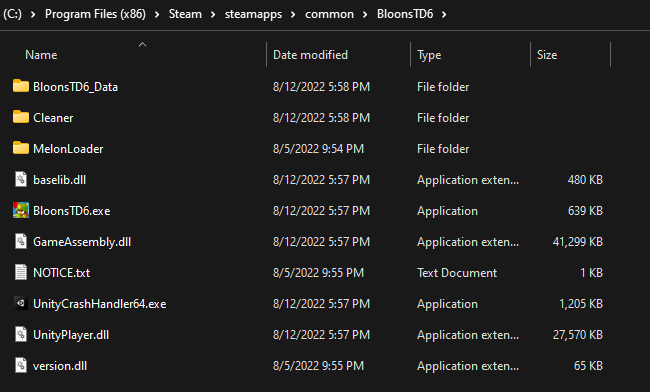
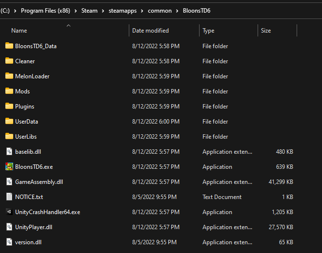
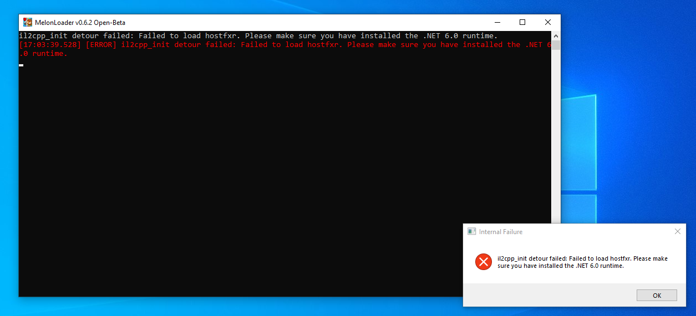
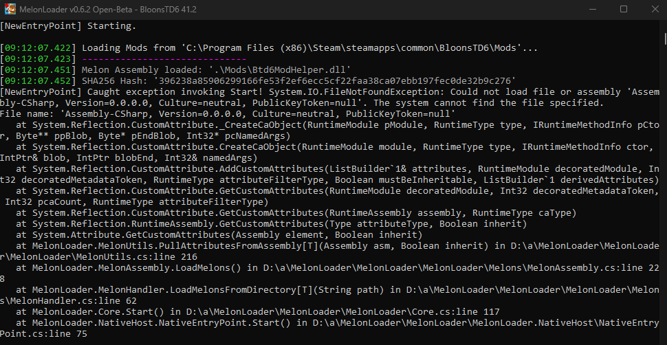

## 1. Have a valid copy of BTD6 on Steam

We can't help you if you don't own a legitimately acquired copy of BTD6 on Steam.

**Mods for Android, IOS, or pirated clients are not supported**

## 2 Download the .NET Runtime

If you don't have or are unsure whether you have the .NET 6.0 (or higher) runtime, you
should [download it from Microsoft](https://dotnet.microsoft.com/en-us/download/dotnet/thank-you/runtime-desktop-6.0.29-windows-x64-installer)

It is **required** for MelonLoader to work for IL2CPP games like BTD6.

## 3. Install MelonLoader

BTD Mod Helper requires <u>MelonLoader v0.6.1</u> or above. You should follow
the [instructions here](https://melonwiki.xyz/#/?id=automated-installation) for downloading and using the MelonLoader
installer. By default your BloonsTD6 folder will be located somewhere
like `C:\Program Files (x86)\Steam\steamapps\common\BloonsTD6`. If that's not correct, you can right click the game in
your Steam library and select "Manage" > "Browse Local Files" to see where they are. For Epic, the default install path
is or `C:\Program Files\Epic Games\BloonsTD6`.

After the installation, tour BloonsTD6 Folder should then look something like this:

Then, the next time you open the game, MelonLoader will spend some time generating the files it needs and also a new
Mods folder within your BloonsTD6 folder. It oughta look similar to

## 4. Install BTD Mod Helper

Download the latest `BTD6ModHelper.dll` from the [GitHub releases](https://github.com/gurrenm3/BTD-Mod-Helper/releases).
You can also press the shiny green button on the main page or just
use [this direct link](https://github.com/gurrenm3/BTD-Mod-Helper/releases/latest/download/Btd6ModHelper.dll).

The one and only installation step is put the `Btd6ModHelper.dll` file into your Mods folder. If you're updating from a
version older than 3.0, make sure to delete any previous `BloonsTD6 Mod Helper.dll` file.

If you've done everything right, you should see a new "Mods" button in the bottom right corner of the BTD6 main menu
when you run the game. (Remember that you need to restart to change mods!)

## 5. Install more Mods

As of Mod Helper 3.0 you can use the in-game Mod Browser to view mods that have been published on GitHub.

Just press the button in the bottom right corner of the Main Menu to go to the Mods Screen, and then the Mod Browser
button in the bottom right. Everything else from there should be self-explanatory!

**There is also now a [website version of the Mod Browser](/mod-browser).
For installing the mods downloaded from here (and other places),
all you need to do is save/put the .dll file into your Mods folder in the same way as BtdModHelper.dll.**

The other best place for finding mods is from one of the BTD6 Modding discord communities:

[BTD6 Mods and Discussion](https://discord.gg/NnD6nRH)

It's not recommended for you to get mods from other sites such as Nexus Mods. Nothing against the site itself, but for
BTD6 it just never caught on as a place for quality, good intentioned mods.

## Troubleshooting

## Common Issues

### Internal Failure / il2cpp_init_detour / .NET 6.0 runtime

This is the error you will get if you try to run the game without having the .NET 6.0 (or higher) Runtime.
Please [download it from Microsoft](https://dotnet.microsoft.com/en-us/download/dotnet/thank-you/runtime-desktop-6.0.29-windows-x64-installer).

### Missing Assembly-Charp.dll

An error such as `Could not load file or assembly 'Assembly-CSharp, ...'` means that MelonLoader did not install
correctly.

Open up the MelonLoader installer again and use the Uninstall feature. Then, try installing and opening the game again,
making any/all of the following changes

- Run the MelonLoader installer as Administrator
- Temporarily disable any anti virus software your computer uses
- Use a different minor version of MelonLoader (e.g. choose 0.6.1 in the dropdown instead of 0.6.2)

## Other Tips

You should **not** rename the BloonsTD6.exe file to anything else, or use different names for mod dll files.

You should also **not** copy the BloonsTD6 install folder to somewhere else and run it from there.
You can make backups of your install folder, but always run the game from the actual path that Steam or Epic considers
it to be installed at.

## Uninstalling

To restore your BTD6 install to completely clean state so that it no longer recognizes you as a modder, you must do ALL
of:

* Delete or move the `MelonLoader` folder from the BloonsTD6 folder
* Delete or move out the `Mods` folder from the BloonsTD6 folder
* Delete or move out the `version.dll` file from the BloonsTD6 folder
