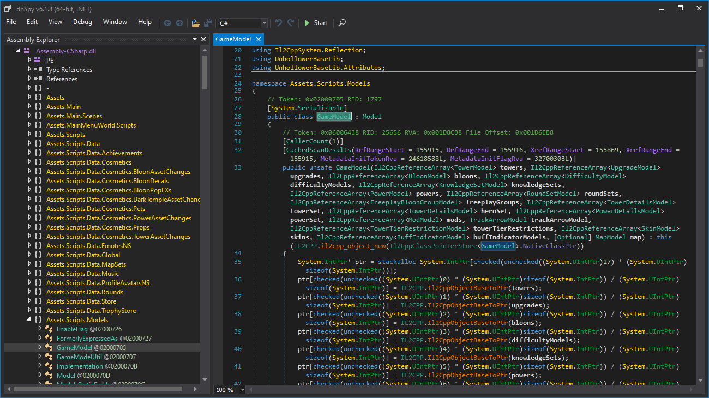
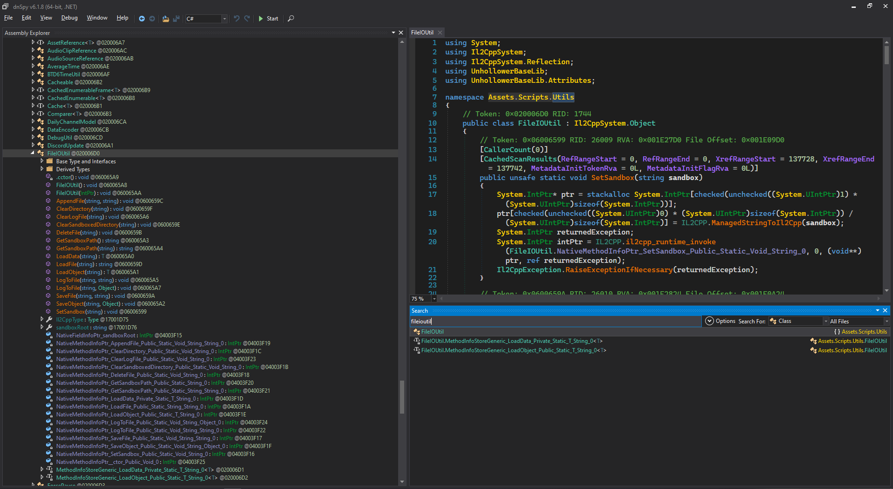
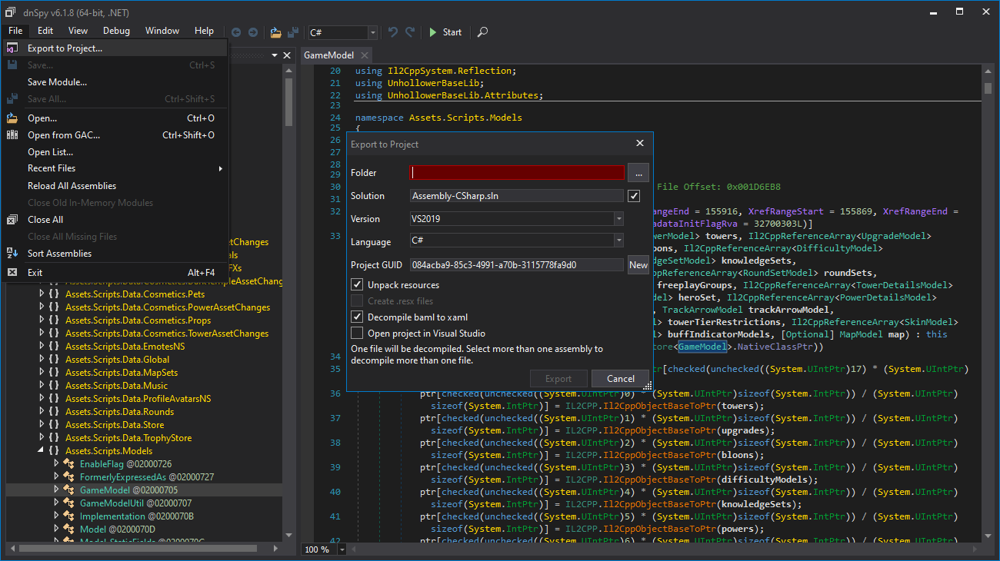
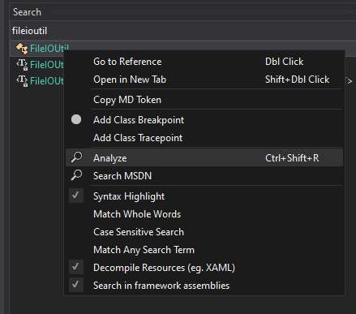

# dnSpy

[dnSpy](https://github.com/dnSpy/dnSpy/releases) is a program that lets you look into compiled Assemblies to see their
code, to a certain extent. For Bloons TD 6, this means we'll be
opening `...\BloonsTD6\MelonLoader\Managed\Assembly-CSharp.dll` file to look at the Main Bloons TD 6 code.
It'll look something like this: 

You can navigate around the Assembly just using dnSpy, especially using the search function:

or you can go to File -> Export to Project to save it as a .csproj that you can open up in your favorite IDE to navigate
around in a more familiar way.

## Limitations

Unfortunately, due to the game's usage of [IL2CPP](https://github.com/gurrenm3/BTD-Mod-Helper/wiki/IL2CPP-Is-Weird),
we're limited in what we can see through this method.

### What We CAN See

* File, Method, Field, Property Names
* Method, Field, Property types used
* Number of times a Method/Class is used (using Analyze)

### What we CAN'T See

* The actual code within method bodies
* The places where methods get called

When you look around the code, you'll basically as see the same pattern of Method stub used, which is basically: Convert
parameters to C++y forms, call the particular C++ compiled native method, manually raise necessary exceptions.

Needless to say, that information isn't really useful. This is not a method that will let you get an understanding of
what Methods actually do and how they do it.

Still, it can be useful to look at all the Names and Types of things within a Class

# ADVANCED: IDA

You can use decompilation software like IDA on "...\BloonsTD6\GameAssembly.dll" to look at the actual assembly code to
see what methods do, or more accurately, look at IDA's attempt to generate C Pseudocode for that assembly code.

More info coming at a later time.