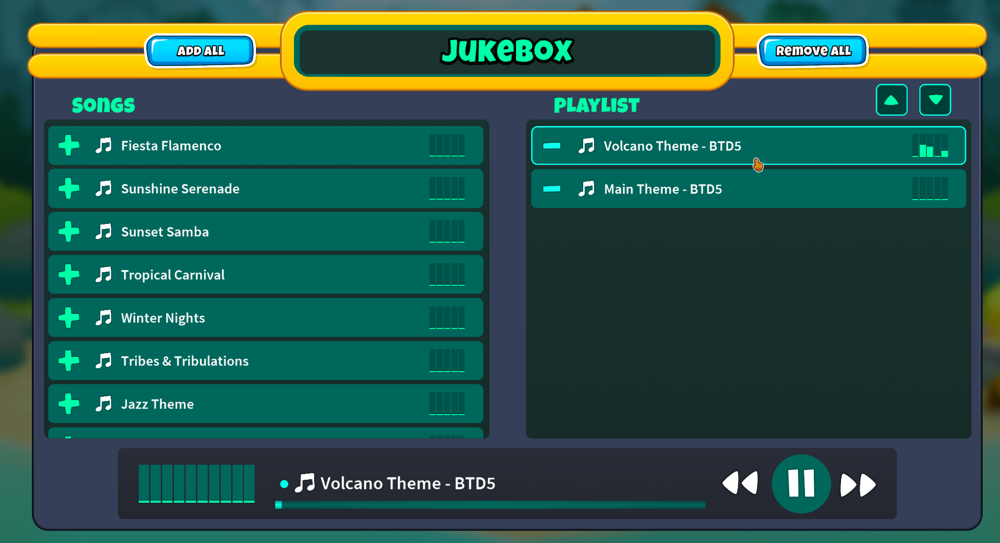

**This guide assumes that you already have at least a basic knowledge of C#, and have set up a modding environment as explained on this wiki.**

Adding your own jukebox track to the game as is simple as including an audio file (.mp3 or .wav) in your C# Project and then defining a corresponding `ModJukeboxTrack` class to go with it.

# [ModJukeboxTrack](/docs/BTD_Mod_Helper.Api.Audio.ModJukeboxTrack)

## Common Overrides

`AudioClipName`: This is the name of the AudioClip that your track will use. 
By default, all .mp3 and .wav files in your project get embedded and put into AudioClips of the same name (but without the file extension).
If you have MainThemeBTD5.wav in your project, you'd put `MainThemeBTD5` as your `AudioClipName`.
The default value is just the name of your class, so you could also just have your class name be `MainThemeBTD5` and you wouldn't even need to override this.

`DisplayName`: This sets the name that will be shown to users from within the Jukebox UI.

`AssetBundleName`: If instead of loading from an embedded audio file you want to load from an embedded Unity AssetBundle,
put the name of the bundle here (not including the .bundle extension). Then, `AudioClipName` will be used as the name
of the asset it tries to find within your bundle. In this case, it may include the file extension, depending on how the
bundle is setup.

`AudioClip`: If you want to implement more advanced functionality for where it gets its audio clip, you can override
this property to change it from having the default behavior that's described for the above two properties.

## Examples

With a project structure like

```
| MainThemeBTD5.cs
| MainThemeBTD5.mp3
| VolcanoThemeBTD5.cs
| VolcanoThemeBTD5.mp3
```

And `ModJukeboxTrack` classes defined as so

```csharp
internal class MainThemeBTD5 : ModJukeboxTrack
{
    public override string AudioClipName => "MainThemeBTD5"; // could be omitted because the default is the class name
    
    public override string DisplayName => "Main Theme - BTD5";
}
```

```csharp
internal class VolcanoThemeBTD5 : ModJukeboxTrack
{
    public override string AudioClipName => "VolcanoThemeBTD5"; // could be omitted because the default is the class name
    
    public override string DisplayName => "Volcano Theme - BTD5";
}
```

You should have the result



Being able to see and add the newly added Jukebox tracks to your playlist