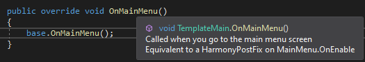

This page covers what you need to have before you get started with BTD modding.

## Owning BTD6

We are only providing support for modifying legitimately purchased copies of the game. Seriously, it's $10 and goes on sale all the time. Just buy it.

## Having an IDE (Integrated Development Environment)

The kind of modding that we're supporting with the helper is a bit too advanced to just use a standard text editor like Notepad. You're going to want to use an actual C# IDE, with our recommendation being **[Visual Studio Community](https://visualstudio.microsoft.com/vs/community/)**. 

Other viable options exist like JetBrains [Rider](https://www.jetbrains.com/rider/) (free 30 day trial, more familiar for IntelliJ users) or [VSCode](https://code.visualstudio.com/download) (free, more generalized, would need to download the right extensions for all required features.) In this guide however, we'll only be covering Visual Studio.

## Visual Studio

Go through the Visual Studio installation process as normal, just being sure that you have selected the ".NET desktop development tools" Workload.

NEW WITH VS 2022: Make sure ".NET Framework 4.8 development tools" and/or ".NET Framework 4.7.2 development tools" are included in your workloads as well.

## Basic Understanding of C#

This wiki is not a C# tutorial. There are many places online you can go to in order to learn more. BTD mods will almost always be open source, so you can also try to learn more by looking at them.

## Mod Helper Documentation

Users of the Mod Helper may have noticed that our [releases](https://github.com/gurrenm3/BTD-Mod-Helper/releases) come with both a .dll file and .xml file. The .dll is obviously the mod itself, but the .xml file represents all the internal documentation that we've added to the Mod Helper.

To be able to see all this documentation from within your IDE, all you have to do is make sure you have the .xml file in the same folder as the .dll file that you added to your project as a dependency.

Then, you should be able to see helpful comments like on Mod Helper methods like this

 